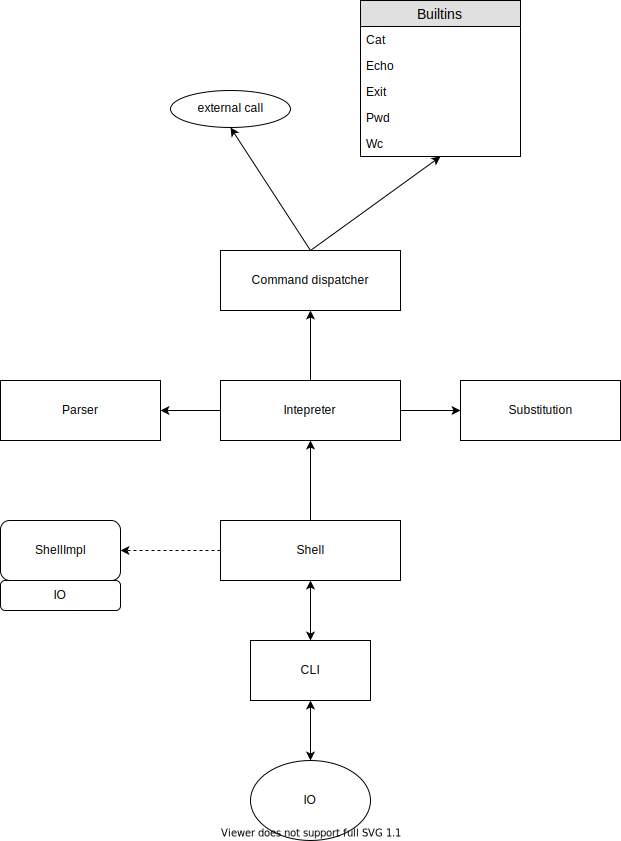

# hw1-CLI
## Сборка
Для сборки требуется [stack](https://docs.haskellstack.org/en/stable/README/).

Сборка: `stack build`

Запуск тестов: `stack test`

Запуск программы `stack exec hw1-CLI-exe`

## Архитектура

Класс Shell предоставляет интерфейс для работы с системой. Так как он расширяет какую-то монаду, то его можно компоновать в действия, чем мы и пользуемся.
Таким образом класс Shell представлаяет собой некоторые действия с системой. 
Сам же Shell состоит из нескольких других классов, предоставляющих конкретные дествия с системой (например, чтение из файла).
Модуль Interpreter предоставляет функцию eval, которая по текстовому представлению строит Shell. 
Interpreter использует Parser и Substituton для разбиения команды на токены.
BuiltinDispatch по разбиению на токены возвращает одну из встроенных команд, либо вызов внешнего процесса, если такой не нашлось.
Модуль CLI использует конкретную реализацию Shell и итерпретатор, которому передает считанные строки, и выполняет построенные действия.

## Библиотека для разбора аргументов

Я использовал `optparse-applicative`, так как она имеет удобный аппликативный интерфейс,
у нее хорошая лицензия, она имеет очень хорошие оценки и очень популярная.
Ее главное отличие для меня от альтернатив это, то, что она позволяет удобно
запускать парсер из чистого кода, не используя `IO`.

`argparser`, `cmdargs`, `console-program` и `options` могли бы быть хорошей альтернативой, но к сожалению они все используют `IO`, что было
бы не очень удобно.
`parseargs` позволяет парсить без эффектов, но `optparse-applicative` более популярен, поэтому я выбрал его.
